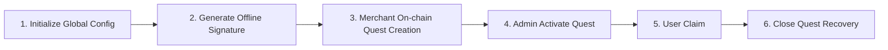

# Sharely Contract

> Globally Unique Quest + Offline Signature Backend

## Table of Contents

- [Requirements](#requirements)
- [Quick Start](#quick-start)
- [Important Notes](#important-notes)
- [Architecture Overview](#architecture-overview)
- [Instruction Reference](#instruction-reference)
- [Script Usage](#script-usage)
- [Event Reference](#event-reference)
- [Complete Workflow](#complete-workflow)

---

## Requirements

| Tool | Version |
|------|---------|
| Node.js | v20.18.1 |
| Solana CLI | 3.0.8 (src:b4d1c774; feat:3604001754, client:Agave) |
| Rust | rustc 1.81.0 |
| Anchor CLI | 0.31.1 |

---

## Quick Start

### Build and Deploy

1. **Update Dependencies**
   ```bash
   cargo update
   ```

2. **Clean Build Cache**
   ```bash
   cargo clean
   ```

3. **Configure Admin Address**
   - Edit `programs/sharely-contract/src/lib.rs`
   - Replace `AUTHORIZED_ADMIN` with the actual admin address

4. **Get and Configure Program ID**
   ```bash
   anchor keys list
   ```
   - Replace the obtained `programId` in the following locations:
     - `Anchor.toml` in `[programs.devnet]`, `[programs.localnet]`, `[programs.mainnet]`
     - `PROGRAM_ID` in `.env` file
     - `declare_id!("")` in `programs/sharely-contract/src/lib.rs`

5. **Build Program**
   ```bash
   anchor build
   ```

6. **Deploy Program**
   ```bash
   anchor deploy
   ```

---

## Important Notes

### ⚠️ Security Warning

- **Do not use production admin private keys in this project**
- Admin private keys in this project are for testing only

### 📡 RPC Node Selection

**Testing Phase:**
- Devnet: `https://api.devnet.solana.com`
- Mainnet: `https://api.mainnet.solana.com`

**Production Environment:**
- Official RPC does not return transaction logs older than approximately one week, which may cause event parsing failures
- Recommended to use third-party RPC services (e.g., [QuickNode](https://dashboard.quicknode.com/))
- Create Solana endpoints and configure to `RPC_URL` in `.env`

---

## Architecture Overview

### Role Definitions

| Role | Responsibilities |
|------|------------------|
| **Admin** | Offline signature approval for Quest parameters, activate/pause/cancel Quest |
| **Merchant** | Submit initialization and funding, close and recover unclaimed funds |
| **User** | Claim airdrop within the time window |

### Business Flow



**Detailed Flow:**

1. **Initialize Global Config**: Admin calls `initialize` to set admin and treasury addresses (execute once only)
2. **Generate Offline Signature**: Admin performs Ed25519 signature on `{program_id, merchant, mint, quest_id, total_amount, start_at, end_at, nonce}`
3. **Merchant On-chain**: First attach ed25519 verification instruction, then call `initialize_quest_by_merchant` to complete quest creation and funding
4. **Activate Quest**: Admin calls `activate_quest` to set merkle root, user count, start/end time, fee and start the quest
5. **User Claim**: Users call `claim` within the time window to claim airdrop
6. **Close Quest**: After end time, merchant or admin calls `close_quest` to recover unclaimed funds

### PDA Account Structure

| Account | Seeds | Description |
|---------|-------|-------------|
| `config` | `["config"]` | Global config account, stores admin and treasury |
| `quest` | `["quest", quest_id_le]` | Quest account |
| `vault_authority` | `["vault_auth", quest]` | Vault authority account |
| `vault` | `ATA(mint, vault_authority)` | Token vault account |
| `bitmap` | `["bitmap", quest]` | Claim bitmap account |

---

## Instruction Reference

### Initialization Instructions

#### `initialize(admin, treasury)`
- **Permission**: Admin only, execute once only
- **Function**: Initialize global config account, set admin and treasury addresses

### Quest Management Instructions

#### `initialize_quest_by_merchant(quest_id, total_amount, approval_bytes)`
- **Permission**: Merchant
- **Function**:
  - Verify ed25519 signature (from sysvar instructions) and message body
  - Create quest, write `{merchant, admin, total_amount}`
  - Transfer `total_amount` from merchant ATA to vault
  - Status: `Pending`

#### `activate_quest(merkle_root, user_count, start_at, end_at, fee_amount)`
- **Permission**: Admin only
- **Function**:
  - Set merkle root, user count, start/end time, fee
  - Create or update bitmap account
  - Status: `Active` (no claims occurred)

#### `claim(index, amount, proof)`
- **Permission**: User
- **Function**:
  - Time window + merkle verification
  - Transfer from vault to user ATA
  - Update bitmap to mark as claimed

#### `pause_quest() / resume_quest()`
- **Permission**: Admin only
- **Function**: Pause/resume quest

#### `cancel_quest()`
- **Permission**: Admin only
- **Function**: Cancel quest, transfer tokens from vault back to merchant ATA

#### `close_quest_by_merchant()`
- **Permission**: Merchant only, requires `now > end_at`
- **Function**: Close quest, transfer fee to treasury, remaining funds back to merchant ATA

### Configuration Management Instructions

#### `change_admin(new_admin)`
- **Permission**: Admin only
- **Function**: Change admin address

#### `update_treasury(new_treasury)`
- **Permission**: Admin only
- **Function**: Change treasury address

---

## Script Usage

### Initialization Scripts

#### `scripts/admin/init_global_config.ts`
Initialize global configuration

**Environment Variables:**
- `ADMIN_SECRET_JSON` - Admin private key JSON
- `TREASURY_PUBKEY` - Treasury address
- `RPC_URL` - RPC node address

**Command:**
```bash
npm run admin:init:config
```

---

### Admin Scripts

#### `scripts/admin/generate-merkle.ts`
Generate Merkle tree

**Notes:**
- Prepare user airdrop list and amounts in advance, refer to the script
- Save generated `MERKLE_ROOT_HEX` to `.env`

**Command:**
```bash
npm run admin:gen-merkle
```

#### `scripts/admin/admin_sign.ts`
Generate offline message and signature

**Environment Variables:**
- `ADMIN_SECRET_JSON` - Admin private key JSON
- `PROGRAM_ID` - Program ID (obtain via `anchor keys list`)
- `MERCHANT_PUBKEY` - Merchant address
- `MINT_PUBKEY` - USDT or USDC token address
- `QUEST_ID` - Quest ID
- `TOTAL_AMOUNT` - Total amount
- `START_AT` - Start timestamp
- `END_AT` - End timestamp

**Output:**
- `ADMIN_PUBKEY` - Admin public key
- `MESSAGE_BASE58` - Message Base58 encoded
- `SIGNATURE_BASE58` - Signature Base58 encoded

**Command:**
```bash
npm run admin:sign
```

#### `scripts/admin/activate_quest.ts`
Activate quest (set merkle root and start)

**Environment Variables:**
- `ADMIN_SECRET_JSON` - Admin private key JSON
- `QUEST_ID` - Quest ID
- `MERKLE_ROOT_HEX` - 64-character hexadecimal string (32 bytes)
- `USER_COUNT` - Airdrop user count, must be greater than or equal to actual airdrop count
- `RPC_URL` - RPC node address

**Notes:**
- Script automatically calculates `start_at` (current time + 600 seconds) and `end_at` (start_at + 7 days)
- `fee_amount` is a fixed value
- Modify the script if custom time is needed

**Command:**
```bash
npm run admin:activate:quest
```

#### `scripts/admin/pause.ts`
Pause quest

**Environment Variables:**
- `ADMIN_SECRET_JSON` - Admin private key JSON
- `QUEST_PUBKEY` - Quest account address
- `RPC_URL` - RPC node address

**Command:**
```bash
npm run admin:pause
```

#### `scripts/admin/resume.ts`
Resume quest

**Environment Variables:**
- `ADMIN_SECRET_JSON` - Admin private key JSON
- `QUEST_PUBKEY` - Quest account address
- `RPC_URL` - RPC node address

**Command:**
```bash
npm run admin:resume
```

#### `scripts/admin/change_admin.ts`
Change admin address

**Environment Variables:**
- `ADMIN_SECRET_JSON` - Current admin private key JSON
- `NEW_ADMIN_PUBKEY` - New admin address
- `RPC_URL` - RPC node address

**Command:**
```bash
npm run admin:change:admin
```

#### `scripts/admin/change_treasury.ts`
Change treasury address

**Environment Variables:**
- `ADMIN_SECRET_JSON` - Admin private key JSON
- `NEW_TREASURY_PUBKEY` - New treasury address
- `RPC_URL` - RPC node address

**Command:**
```bash
npm run admin:change:treasury
```

#### `scripts/admin/close.ts`
Close quest and recover unclaimed airdrop

**Environment Variables:**
- `ADMIN_SECRET_JSON` - Admin private key JSON
- `QUEST_PUBKEY` - Quest account address
- `DESTINATION_ATA` or `MERCHANT_PUBKEY` - Destination ATA address or wallet address (choose one)
- `RPC_URL` - RPC node address

**Note:** Quest must be closed after the quest end time

**Command:**
```bash
npm run admin:close
```

---

### Merchant Scripts

#### `scripts/merchant/merchant_init.ts`
Assemble ed25519 instruction and call `initialize_quest_by_merchant`

**Environment Variables:**
- `MERCHANT_SECRET_JSON` - Merchant private key JSON
- `ADMIN_PUBKEY` - Admin public key
- `PROGRAM_ID` - Program ID
- `MINT_PUBKEY` - Token mint address
- `QUEST_ID` - Quest ID
- `TOTAL_AMOUNT` - Total amount
- `MESSAGE_BASE58` - Message generated by `admin_sign.ts`
- `SIGNATURE_BASE58` - Signature generated by `admin_sign.ts`
- `RPC_URL` - RPC node address

**Command:**
```bash
npm run merchant:init
```

#### `scripts/merchant/close.ts`
Merchant close quest (merchant only)

**Environment Variables:**
- `MERCHANT_SECRET_JSON` - Merchant private key JSON
- `QUEST_PUBKEY` - Quest account address
- `RPC_URL` - RPC node address

**Note:** Must be executed after quest end time

**Command:**
```bash
npm run merchant:close
```

---

### User Scripts

#### `scripts/user/claim.ts`
User claim airdrop

**Environment Variables:**
- `USER_SECRET_JSON` - User private key JSON
- `QUEST_PUBKEY` - Quest account address
- `MINT_PUBKEY` - Token mint address
- `INDEX` - User index when generating Merkle tree
- `AMOUNT` - User amount when generating Merkle tree
- `PROOF_JSON` - Proof corresponding to user in Merkle tree
- `RPC_URL` - RPC node address

**Command:**
```bash
npm run user:claim
```

---

## Event Reference

All events include the `quest_id` field, allowing the backend to directly obtain questId without querying the database through questAddress.

| Event | Fields |
|-------|--------|
| `QuestCreated` | `quest_id` |
| `VaultFunded` | `quest_id` |
| `QuestActivated` | `quest_id`, `start_at`, `end_at`, `fee_amount` |
| `Claimed` | `quest_id` |
| `QuestStatusChanged` | `quest_id` |
| `QuestClosed` | `quest_id` |
| `QuestCancelled` | `quest_id` |
| `BitmapInitialized` | `quest_id` |

---

## Complete Workflow

The following is the standard operation flow after successful deployment. You need to replace the parameters generated in each step into environment variables:

### 1. Initialize Global Configuration (Execute Once Only)

```bash
npm run admin:init:config
```

### 2. Generate Admin Signature

```bash
npm run admin:sign
```

**Save output results to environment variables:**
- `ADMIN_PUBKEY`
- `MESSAGE_BASE58`
- `SIGNATURE_BASE58`

### 3. Merchant Initialize Quest

```bash
npm run merchant:init
```

### 4. Generate Merkle Tree (If Needed)

```bash
npm run admin:gen-merkle
```

**Save generated `MERKLE_ROOT_HEX` to environment variables**

### 5. Admin Activate Quest

```bash
npm run admin:activate:quest
```

### 6. User Claim

```bash
npm run user:claim
```

### 7. Close Quest (Merchant or Admin)

```bash
# Admin close
npm run admin:close

# Or merchant close
npm run merchant:close
```

---

## License

This project is licensed under the [MIT License](LICENSE).

**Copyright (c) 2025 sharely-org**

MIT License is a permissive open source license that allows:
- ✅ Commercial use
- ✅ Modification
- ✅ Distribution
- ✅ Private use

**Limitations:**
- ❌ No warranty
- ❌ No liability

**Requirements:**
- 📄 License and copyright notice must be included

For the full license text, please see the [LICENSE](LICENSE) file.

