# Sharely Contract

> Quest 全局唯一 + 后台离线签名

## 目录

- [环境要求](#环境要求)
- [快速开始](#快速开始)
- [重要说明](#重要说明)
- [架构概览](#架构概览)
- [指令说明](#指令说明)
- [脚本使用](#脚本使用)
- [事件说明](#事件说明)
- [完整流程](#完整流程)

---

## 环境要求

| 工具 | 版本 |
|------|------|
| Node.js | v20.18.1 |
| Solana CLI | 3.0.8 (src:b4d1c774; feat:3604001754, client:Agave) |
| Rust | rustc 1.81.0 |
| Anchor CLI | 0.31.1 |

---

## 快速开始

### 构建与部署

1. **更新依赖**
   ```bash
   cargo update
   ```

2. **清理构建缓存**
   ```bash
   cargo clean
   ```

3. **获取并配置 Program ID**
   ```bash
   anchor keys list
   ```
   - 将获取的 `programId` 替换到以下位置：
     - `Anchor.toml` 中的 `[programs.devnet]`、`[programs.localnet]`、`[programs.mainnet]`
     - `.env` 文件中的 `PROGRAM_ID`
     - `programs/sharely-contract/src/lib.rs` 中的 `declare_id!("")`

4. **构建程序**
   ```bash
   anchor build
   ```

5. **部署程序**
   ```bash
   anchor deploy
   ```

---

## 重要说明

### ⚠️ 安全提示

- **生产环境管理员私钥请勿在此项目中使用**
- 本项目中的管理员私钥仅用于测试

### 📡 RPC 节点选择

**测试阶段：**
- Devnet: `https://api.devnet.solana.com`
- Mainnet: `https://api.mainnet.solana.com`

**生产环境：**
- 官方 RPC 在获取交易详情时，不会返回超过一周的日志，可能导致无法解析事件
- 建议使用第三方 RPC 服务（如 [QuickNode](https://dashboard.quicknode.com/)）
- 创建 Solana endpoints 后配置到 `.env` 的 `RPC_URL`

---

## 架构概览

### 角色定义

| 角色 | 职责 |
|------|------|
| **Admin（管理员）** | 离线签名批准 Quest 参数、激活/暂停/取消 Quest |
| **Merchant（商户）** | 提交初始化并注资、关闭并回收未领取资金 |
| **User（用户）** | 在时间窗内领取空投 |

### 业务流程

```mermaid
graph LR
    A[1. 初始化全局配置] --> B[2. 生成离线签名]
    B --> C[3. 商户上链创建 Quest]
    C --> D[4. 管理员激活 Quest]
    D --> E[5. 用户领取]
    E --> F[6. 关闭 Quest 回收]
```



**详细流程：**

1. **初始化全局配置**：Admin 调用 `initialize` 设置 admin 和 treasury 地址（仅需执行一次）
2. **生成离线签名**：Admin 对 `{program_id, merchant, mint, quest_id, total_amount, start_at, end_at, nonce}` 进行 Ed25519 签名
3. **商户上链**：先附加 ed25519 校验指令，再调用 `initialize_quest_by_merchant` 完成 quest 创建与注资
4. **激活 Quest**：Admin 调用 `activate_quest` 设置 merkle root、用户数量、开始/结束时间、手续费并启动 quest
5. **用户领取**：用户在时间窗内调用 `claim` 领取空投
6. **关闭 Quest**：结束后商户或管理员调用 `close_quest` 回收未领取资金

### PDA 账户结构

| 账户 | Seeds | 说明 |
|------|-------|------|
| `config` | `["config"]` | 全局配置账户，存储 admin 和 treasury |
| `quest` | `["quest", quest_id_le]` | Quest 账户 |
| `vault_authority` | `["vault_auth", quest]` | Vault 权限账户 |
| `vault` | `ATA(mint, vault_authority)` | Token 金库账户 |
| `bitmap` | `["bitmap", quest]` | 领取位图账户 |

---

## 指令说明

### 初始化指令

#### `initialize(admin, treasury)`
- **权限**：仅 admin，仅需执行一次
- **功能**：初始化全局配置账户，设置 admin 和 treasury 地址

### Quest 管理指令

#### `initialize_quest_by_merchant(quest_id, total_amount, approval_bytes)`
- **权限**：商户
- **功能**：
  - 校验 ed25519 签名（从 sysvar instructions）与消息体
  - 创建 quest，写入 `{merchant, admin, 总额度}`
  - 从商户 ATA 注资 `total_amount` 到 vault
  - 状态：`Pending`

#### `activate_quest(merkle_root, user_count, start_at, end_at, fee_amount)`
- **权限**：仅 admin
- **功能**：
  - 设置 merkle root、用户数量、开始/结束时间、手续费
  - 创建或更新位图账户
  - 状态：`Active`（未发生领取）

#### `claim(index, amount, proof)`
- **权限**：用户
- **功能**：
  - 时间窗 + merkle 校验
  - 从 vault 转至用户 ATA
  - 更新位图标记已领取

#### `pause_quest() / resume_quest()`
- **权限**：仅 admin
- **功能**：暂停/恢复 quest

#### `cancel_quest()`
- **权限**：仅 admin
- **功能**：取消 quest，将 vault 中的 token 转回商户 ATA

#### `close_quest_by_merchant()`
- **权限**：仅 merchant，需 `now > end_at`
- **功能**：关闭 quest，将手续费转至 treasury，剩余转回商户 ATA

### 配置管理指令

#### `change_admin(new_admin)`
- **权限**：仅 admin
- **功能**：更改管理员地址

#### `update_treasury(new_treasury)`
- **权限**：仅 admin
- **功能**：更改 treasury 地址

---

## 脚本使用

### 初始化脚本

#### `scripts/admin/init_global_config.ts`
初始化全局配置

**环境变量：**
- `ADMIN_SECRET_JSON` - 管理员私钥 JSON
- `TREASURY_PUBKEY` - Treasury 地址
- `RPC_URL` - RPC 节点地址

**命令：**
```bash
npm run admin:init:config
```

---

### 管理脚本

#### `scripts/admin/generate-merkle.ts`
生成默克尔树

**说明：**
- 提前准备好用户的空投和数量，参考脚本
- 生成的 `MERKLE_ROOT_HEX` 放到 `.env`

**命令：**
```bash
npm run admin:gen-merkle
```

#### `scripts/admin/admin_sign.ts`
生成离线消息与签名

**环境变量：**
- `ADMIN_SECRET_JSON` - 管理员私钥 JSON
- `PROGRAM_ID` - 程序 ID（通过 `anchor keys list` 获取）
- `MERCHANT_PUBKEY` - 商户地址
- `MINT_PUBKEY` - USDT 或 USDC token 地址
- `QUEST_ID` - Quest ID
- `TOTAL_AMOUNT` - 总金额
- `START_AT` - 开始时间戳
- `END_AT` - 结束时间戳

**输出：**
- `ADMIN_PUBKEY` - 管理员公钥
- `MESSAGE_BASE58` - 消息 Base58 编码
- `SIGNATURE_BASE58` - 签名 Base58 编码

**命令：**
```bash
npm run admin:sign
```

#### `scripts/admin/activate_quest.ts`
激活 quest（设置 merkle root 并启动）

**环境变量：**
- `ADMIN_SECRET_JSON` - 管理员私钥 JSON
- `QUEST_ID` - Quest ID
- `MERKLE_ROOT_HEX` - 64 位十六进制字符串（32 字节）
- `USER_COUNT` - 空投人数，必须大于或等于实际空投人数
- `RPC_URL` - RPC 节点地址

**注意：**
- 脚本会自动计算 `start_at`（当前时间+600秒）和 `end_at`（start_at+7天）
- `fee_amount` 为固定值
- 如需自定义时间，需要修改脚本

**命令：**
```bash
npm run admin:activate:quest
```

#### `scripts/admin/pause.ts`
暂停 quest

**环境变量：**
- `ADMIN_SECRET_JSON` - 管理员私钥 JSON
- `QUEST_PUBKEY` - Quest 账户地址
- `RPC_URL` - RPC 节点地址

**命令：**
```bash
npm run admin:pause
```

#### `scripts/admin/resume.ts`
恢复 quest

**环境变量：**
- `ADMIN_SECRET_JSON` - 管理员私钥 JSON
- `QUEST_PUBKEY` - Quest 账户地址
- `RPC_URL` - RPC 节点地址

**命令：**
```bash
npm run admin:resume
```

#### `scripts/admin/change_admin.ts`
更改管理员地址

**环境变量：**
- `ADMIN_SECRET_JSON` - 当前管理员私钥 JSON
- `NEW_ADMIN_PUBKEY` - 新管理员地址
- `RPC_URL` - RPC 节点地址

**命令：**
```bash
npm run admin:change:admin
```

#### `scripts/admin/change_treasury.ts`
更改 Treasury 地址

**环境变量：**
- `ADMIN_SECRET_JSON` - 管理员私钥 JSON
- `NEW_TREASURY_PUBKEY` - 新 Treasury 地址
- `RPC_URL` - RPC 节点地址

**命令：**
```bash
npm run admin:change:treasury
```

#### `scripts/admin/close.ts`
关闭 quest 并取回未领取空投

**环境变量：**
- `ADMIN_SECRET_JSON` - 管理员私钥 JSON
- `QUEST_PUBKEY` - Quest 账户地址
- `DESTINATION_ATA` 或 `MERCHANT_PUBKEY` - 接受 ATA 地址或钱包地址（二选一）
- `RPC_URL` - RPC 节点地址

**注意：** 关闭 quest 必须在 quest 结束后才能执行

**命令：**
```bash
npm run admin:close
```

---

### 商户脚本

#### `scripts/merchant/merchant_init.ts`
组装 ed25519 指令并调用 `initialize_quest_by_merchant`

**环境变量：**
- `MERCHANT_SECRET_JSON` - 商户私钥 JSON
- `ADMIN_PUBKEY` - 管理员公钥
- `PROGRAM_ID` - 程序 ID
- `MINT_PUBKEY` - Token mint 地址
- `QUEST_ID` - Quest ID
- `TOTAL_AMOUNT` - 总金额
- `MESSAGE_BASE58` - `admin_sign.ts` 生成的消息
- `SIGNATURE_BASE58` - `admin_sign.ts` 生成的签名
- `RPC_URL` - RPC 节点地址

**命令：**
```bash
npm run merchant:init
```

#### `scripts/merchant/close.ts`
商户关闭 quest（仅商户可调用）

**环境变量：**
- `MERCHANT_SECRET_JSON` - 商户私钥 JSON
- `QUEST_PUBKEY` - Quest 账户地址
- `RPC_URL` - RPC 节点地址

**注意：** 必须在 quest 结束后才能执行

**命令：**
```bash
npm run merchant:close
```

---

### 用户脚本

#### `scripts/user/claim.ts`
用户领取空投

**环境变量：**
- `USER_SECRET_JSON` - 用户私钥 JSON
- `QUEST_PUBKEY` - Quest 账户地址
- `MINT_PUBKEY` - Token mint 地址
- `INDEX` - 生成默克尔树时的 user index
- `AMOUNT` - 生成默克尔树时的 user amount
- `PROOF_JSON` - 默克尔树 user 对应的 proof
- `RPC_URL` - RPC 节点地址

**命令：**
```bash
npm run user:claim
```

---

## 事件说明

所有事件都包含 `quest_id` 字段，方便后端直接获取 questId 而无需通过 questAddress 查询数据库。

| 事件 | 包含字段 |
|------|----------|
| `QuestCreated` | `quest_id` |
| `VaultFunded` | `quest_id` |
| `QuestActivated` | `quest_id`, `start_at`, `end_at`, `fee_amount` |
| `Claimed` | `quest_id` |
| `QuestStatusChanged` | `quest_id` |
| `QuestClosed` | `quest_id` |
| `QuestCancelled` | `quest_id` |
| `BitmapInitialized` | `quest_id` |

---

## 完整流程

以下为部署成功后的标准操作流程，需要自行替换每一步生成的参数到环境变量：

### 1. 初始化全局配置（仅需执行一次）

```bash
npm run admin:init:config
```

### 2. 生成管理员签名

```bash
npm run admin:sign
```

**将输出结果保存到环境变量：**
- `ADMIN_PUBKEY`
- `MESSAGE_BASE58`
- `SIGNATURE_BASE58`

### 3. 商户初始化 Quest

```bash
npm run merchant:init
```

### 4. 生成默克尔树（如需要）

```bash
npm run admin:gen-merkle
```

**将生成的 `MERKLE_ROOT_HEX` 保存到环境变量**

### 5. 管理员激活 Quest

```bash
npm run admin:activate:quest
```

### 6. 用户领取

```bash
npm run user:claim
```

### 7. 关闭 Quest（商户或管理员）

```bash
# 管理员关闭
npm run admin:close

# 或商户关闭
npm run merchant:close
```

---

## 许可证

本项目采用 [MIT License](LICENSE) 许可证。

**Copyright (c) 2025 sharely-org**

MIT License 是一个宽松的开源许可证，允许：
- ✅ 商业使用
- ✅ 修改
- ✅ 分发
- ✅ 私人使用

**限制：**
- ❌ 无担保
- ❌ 无责任

**要求：**
- 📄 保留版权声明和许可证声明

完整的许可证文本请参阅 [LICENSE](LICENSE) 文件。
